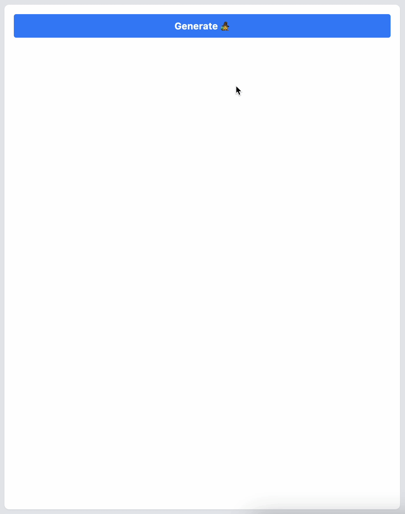

# Example of ChatGPT integration with Next.JS

This is an example of how to integrate ChatGPT with Next.JS and make "typing" effect
by streaming the response from the OpenAI API.

Main logic is in [pages/index.tsx](./src/pages/index.tsx) and [pages/api/chat.tsx](./src/pages/api/chat.ts) and everything else is just a
boilerplate code generated by Next.JS



## How to run

```shell
npm install
npm run dev
```
